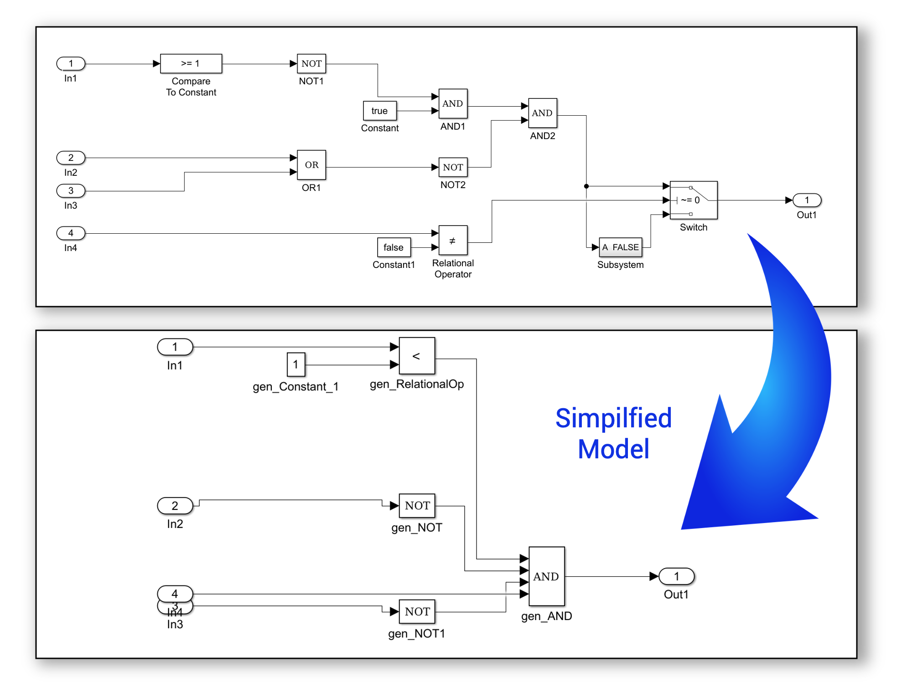

# Simulink Logic Simplifier Tool

The Simulink Logic Simplifier tool automatically simplifies Simulink designs to reduce complexity and save developers time during development and refactoring. The tool specifically focuses on simplifying implementations of combinatorial logic in Simulink, such as those making use of logical operators, relational operators, and many others. After a simplifiation is performed, the tool also facilitates verification to ensure that the behaviour of the original system is preserved in the results.

## User Guide
For installation and other information, please see the [User Guide](doc/SimulinkLogicSimplifier_UserGuide.pdf).
